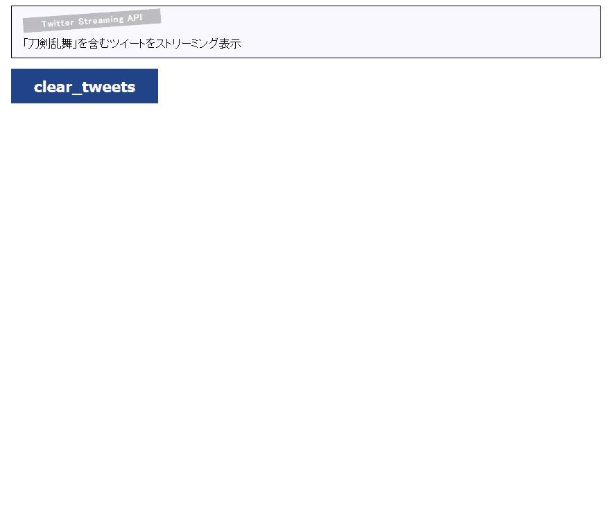

# Web application to show tweets stream on web browser using Twitter Streaming API
- Official description about Twitter Streaming API
    - https://dev.twitter.com/streaming/overview
    - https://dev.twitter.com/streaming/overview/request-parameters

# Screenshot


# Required
- [Node.js](https://nodejs.org/)
- [socket.io package](https://www.npmjs.com/package/socket.io)
- [twitter package](https://www.npmjs.com/package/twitter)

# How to use

```
# node app
```

- Waiting for connection on port 11084 (default) such as `http://localhost:11084/`
- Access above by web browser
- If you wanna clear tweets, push "clear_tweets" button

# Note
- Endpoint is [public streams](https://dev.twitter.com/streaming/public)
- Set [`track` parameter](https://dev.twitter.com/streaming/overview/request-parameters#track) to `刀剣乱舞` as default
    - `刀剣乱舞(ToukenRambu)` is a Japanese simulation game title, whose official page is [here](http://www.dmm.com/netgame/feature/tohken_html/=/navi=none/)
- Routes implement is poor :)

# History

### 2016/11/24 - Version 1.0.2
- Minor bugs fixed
- Codes refactored

### 2016/11/22 - Version 1.0.1
- Minor bugs fixed

### 2016/11/21 - Version 1.0.0
- First release